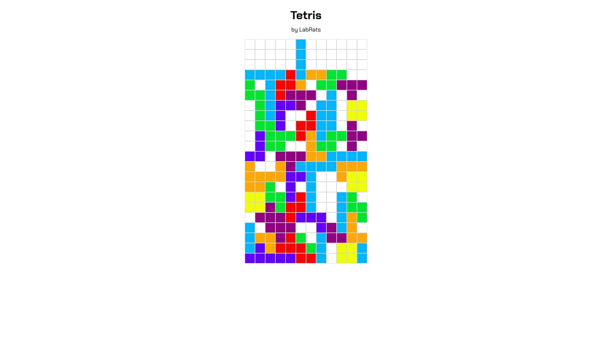

# lab_rats_tetris
LabRats - Tetris

A simple intro project to JavaScript, recreating the famous Tetris game.

Server is only there to supply the files to the web, all the logic is implemented on the client side. All the game modeling is done by DOM manipulation, no HTML5 canvas is used.

